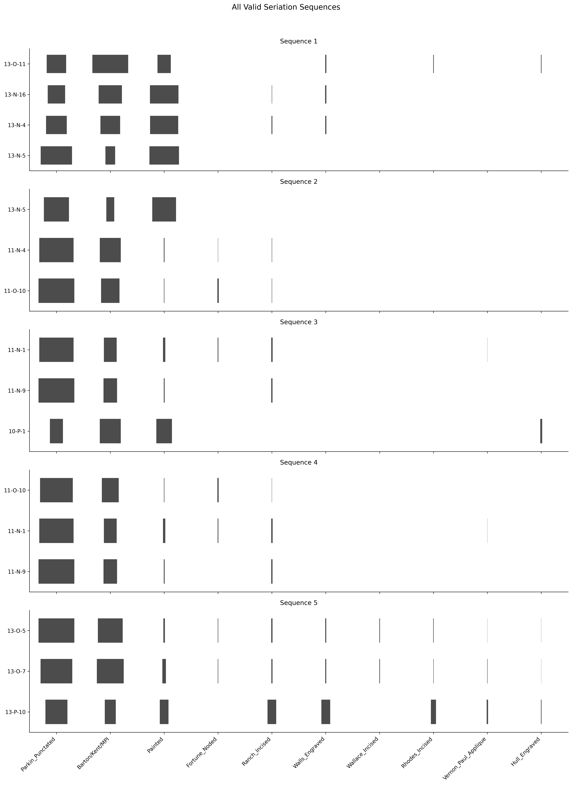
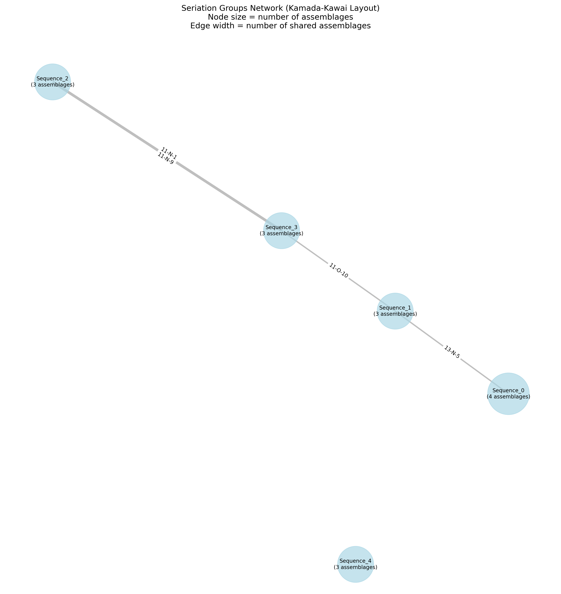

# Archaeological Seriation Analysis Tools

A comprehensive Python toolkit for archaeological seriation analysis, supporting both frequency and occurrence seriation methods. This package includes tools for parallel dynamic programming frequency seriation, occurrence seriation, and network analysis of seriation relationships.




## Features

### Frequency Seriation (SeriationSolverDynamic.py)
- Parallel processing for efficient sequence discovery
- Statistical evaluation of monotonicity using confidence intervals
- Multiple visualization outputs:
  - Individual battleship plots for each sequence
  - Heatmap visualizations
  - Combined summary visualization of all valid sequences
- Network analysis of seriation relationships based on shared assemblages
- Progress monitoring and detailed reporting
- Support for multiple input file formats (CSV, TSV, Excel)

### Occurrence Seriation (occurrenceSeriation.py)
- Analysis of presence/absence patterns
- Dynamic programming approach for finding largest valid groups
- Individual and combined solution visualizations
- Network analysis of solution relationships
- Command-line interface for easy data input

### Network Analysis (network.py)
- Visualization of relationships between seriation sequences
- Analysis of shared assemblages between sequences
- Network statistics and metrics
- High-resolution output graphics
- Automatic integration with seriation analysis

## Installation

### Requirements

```bash
pip install numpy pandas scipy scikit-learn matplotlib seaborn tqdm networkx openpyxl
```

### Dependencies

- Python 3.7+
- numpy
- pandas
- scipy
- scikit-learn
- matplotlib
- seaborn
- tqdm
- networkx
- openpyxl (for Excel file support)

## Usage

### Frequency Seriation with Network Analysis

```bash
# Basic usage with default settings
python SeriationSolverDynamic.py

# Specify custom input file
python SeriationSolverDynamic.py --file your_data.csv

# Full options
python SeriationSolverDynamic.py --file your_data.xlsx \
                                --min_group 4 \
                                --confidence 0.99 \
                                --bootstrap 2000 \
                                --output custom_results \
                                --cores 4

# Run without network analysis
python SeriationSolverDynamic.py --file your_data.csv --no-network
```

### Command Line Arguments

- `--file`: Input data file path (CSV, TSV, or Excel)
- `--min_group`: Minimum group size (default: 3)
- `--confidence`: Confidence level (default: 0.95)
- `--bootstrap`: Number of bootstrap iterations (default: 1000)
- `--output`: Output directory (default: 'seriation_results')
- `--cores`: Number of CPU cores to use (default: all available)
- `--no-network`: Skip network analysis (default: False)

### Occurrence Seriation

```bash
# Run with default test data
python occurrenceSeriation.py

# Run with custom data file
python occurrenceSeriation.py --file path/to/your/data.csv
```

## Input Data Formats

### Frequency Seriation Data
Tab-separated, CSV, or Excel file with:
- First column: Assemblage IDs (used as index)
- Remaining columns: Frequencies for each type
- Header row with type names

Example:
```
Assemblage   Type1   Type2   Type3
Sample1      10      5       2
Sample2      8       7       3
Sample3      4       9       5
```

### Occurrence Seriation Data
CSV file with:
- First column: Artifact identifiers ('Ahu' in test data)
- Remaining columns: Presence (1) or absence (0) for each type
- Header row with type names

Example data available in the testdata directory:
```
Ahu,Type1,Type2,Type3
Artifact1,1,0,1
Artifact2,1,1,0
Artifact3,0,1,1
```

## Output Files

The analysis creates a directory (default: 'seriation_results') containing:

### Frequency Seriation Output
- Individual battleship plots (battleship_0.png, battleship_1.png, etc.)
- Heatmap visualizations (heatmap_0.png, heatmap_1.png, etc.)
- Combined visualization of all sequences (all_sequences.png)
- Text summary of results (seriation_results.txt)
- Network visualization (seriation_network.png)

### Occurrence Seriation Output
- Individual solution visualizations (valid_solution_1.png, etc.)
- Combined solution visualization (all_valid_solutions.png)
- Solution network graph (solution_network_graph.png)

## Analysis Details

### Frequency Seriation
- Uses parallel dynamic programming to find valid sequences
- Evaluates monotonicity with statistical confidence intervals
- Automatically generates battleship curve visualizations
- Creates network analysis of relationships between sequences

### Network Analysis
- Automatically runs after seriation analysis
- Shows relationships between sequences based on shared assemblages
- Edge thickness indicates number of shared assemblages
- Node size reflects sequence length
- Labels show specific shared assemblages

## Directory Structure
```
.
├── SeriationSolverDynamic.py  # Main frequency seriation implementation
├── occurrenceSeriation.py     # Occurrence seriation implementation
├── network.py                 # Network analysis tools
├── testdata/                  # Sample data directory
│   └── ahu.csv               # Test data for occurrence seriation
└── README.md                 # This documentation
```

## Notes

- Both seriation methods use parallel processing for efficient computation
- Statistical evaluation ensures robust sequence identification
- All visualizations are saved in high resolution (300 DPI)
- Network analysis runs automatically unless disabled
- Progress information and error messages are displayed
- The package includes sample data for testing and demonstration

## Common Issues and Solutions

1. File Loading:
   - Ensure input files are properly formatted
   - Check file permissions
   - Verify file exists in specified location

2. Memory Usage:
   - For large datasets, increase available memory
   - Reduce number of parallel cores if needed

3. Network Analysis:
   - Ensure network.py is in the same directory
   - Check if output directory is writable
   - Verify seriation_results.txt was created

## References

Key references for methodology:
- Dunnell, R. C. (1970). Seriation Method and Its Evaluation. American Antiquity, 35(3), 305-319.
- Ford, J. A. (1962). A Quantitative Method for Deriving Cultural Chronology. Technical Manual No. 1, Pan American Union.
- O'Brien, M. J., & Lyman, R. L. (1999). Seriation, Stratigraphy, and Index Fossils: The Backbone of Archaeological Dating.
```
